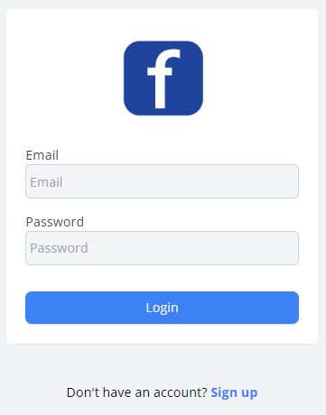
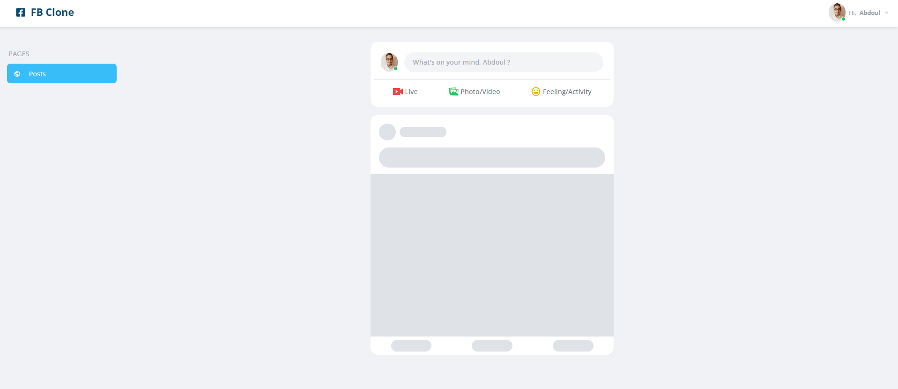
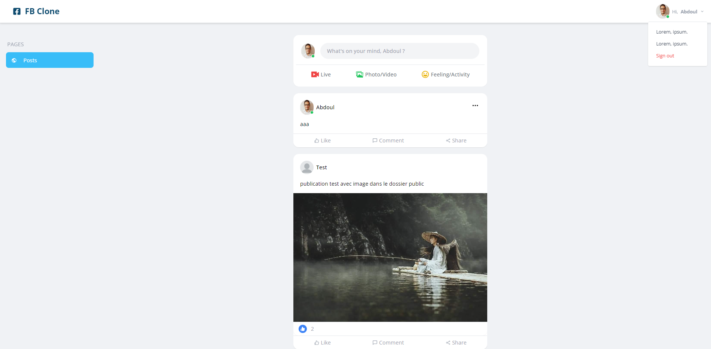
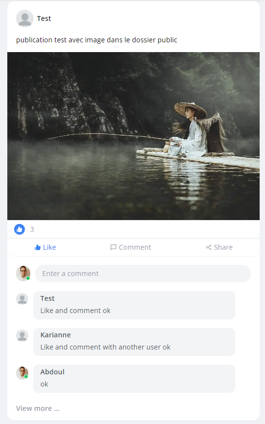

# React JS - Json server : Facebook clone

### Lancer l'application avec json server

> npm install -D -g json-server json-server-auth

> json-server --watch data/db.json -m ./node_modules/json-server-auth --port 4000

---

## Fonctionnalités

- Création d'utilisateurs (sans photo de profil)
- Login / Logout
- Publier un Post (avec ou sans image, PS: image dans dossier public)
- Liker un poste
- Commenter un poste
- Supprimer un poste (un utilisateur peut supprimer seulement son Post)

- Application responsive
- Post lazy loading (loadés 3 à la fois onScroll)

---

## Logins déja présents (10 utilisateurs dans data/db.json):

- email: abdl@gmail.com / password: 123456789
- email: test@gmail.com / password: testtest
- email: antonette@gmail.com / password: 123456789
- ...

---

## Outils

- React js
- Json server
- Tailwind css

---

## Résultat

